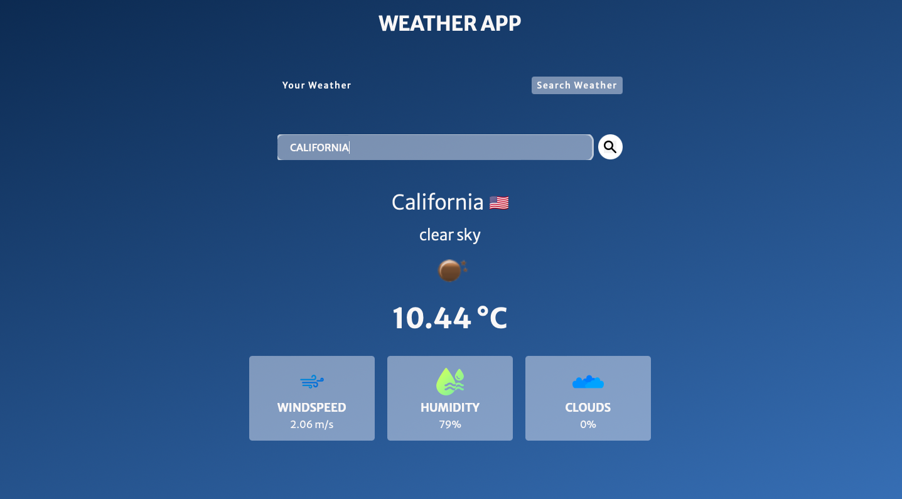

# WEATHER APP ☁️🌤️

A simple and responsive weather application that shows the current weather details of any city, using an OpenWeatherMap API. Built with HTML, CSS, and JavaScript.

# 🚀 Features

Live Weather Updates: Get real-time weather data for any city worldwide.
Temperature Details: Displays temperature in both Celsius and Fahrenheit.
Weather Conditions: Shows conditions like sunny, cloudy, rain, etc.
Additional Info: Includes humidity, wind speed, and more.
Responsive Design: Works on all screen sizes, from desktops to mobile devices.

# 🖼 Preview

